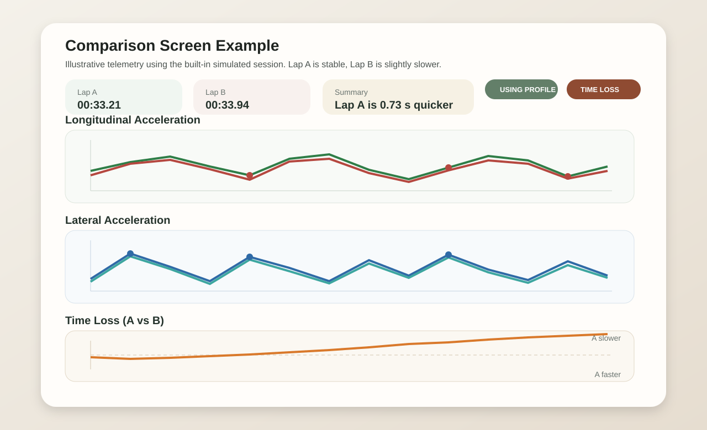
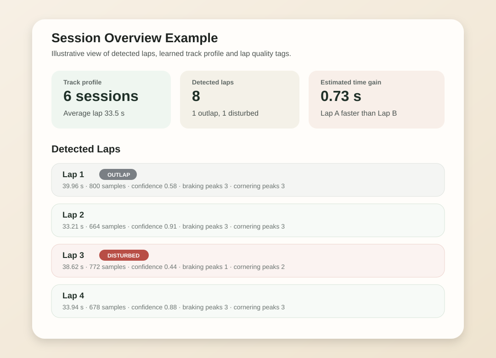

# Karting Tracker

Android app for indoor karting telemetry with smartphone sensors only. No GPS is required.

The app records accelerometer and gyroscope data, processes the signal on-device, segments laps deterministically from IMU patterns, stores sessions as JSON files, and lets you compare laps visually.

## Current Scope

This is a practical usable app version, not a throwaway prototype.

Implemented today:

- recording with accelerometer and gyroscope at `SENSOR_DELAY_FASTEST`
- foreground service based recording with persistent notification
- 2-second calibration before recording
- low-pass filtering
- gravity removal
- derived signals for both chart compatibility and pocket-tolerant detection
- global lap detection with boundary generation, segment scoring, dynamic-programming style segmentation, calibrated confidence scoring, and track-profile biasing
- distinction between `OUTLAP` and `DISTURBED` laps
- explicit lap phases: `NORMAL`, `OUTLAP`, `INLAP`, `INTERRUPTED`
- session quality scoring for processed sessions
- automatic sector detection and sector time calculation without GPS
- track-profile driven stable sector usage when learned sector boundaries exist
- braking and cornering peak markers
- lap comparison with overlay charts, a time loss chart, sector deltas, ideal lap reference, and simple text insights
- session-level coaching insights derived from best-vs-slower lap analysis
- persistent session storage as JSON
- session browser metadata for sample count and JSON file size
- processing-versioned session reanalysis from stored raw sensor data
- periodic autosave during recording with separate partial-session files
- dropdown-based track management with duplicate-safe creation flow
- track-specific learning with reusable profiles, quality guards, and weighted updates
- session browser with filter, reload, and delete actions for sessions or full tracks
- load-last-session shortcut
- debug seeding of three deterministic 10-minute simulated test sessions

Not implemented yet:

- export to CSV or external share target
- fully orientation-invariant directional charts
- full live recording recovery after process death or device reboot
- automated tests
- verified build/run in this environment

## Example Screenshots

These are illustrative example images generated from the app's simulated telemetry and current UI concepts.

### Comparison Example

### Session Stats Example

## How The App Works

### Recording

When you press `Start`, recording does not begin immediately.

The app first starts a foreground service:

- the service promotes itself with a persistent notification within the required startup window
- the notification shows the current track, elapsed time, and sample count
- a stop action in the notification stops recording cleanly
- the service keeps running when the UI goes to background
- the service does not rely on sticky auto-restart after process death
- startup, notification updates, and recorder shutdown are guarded so service failures degrade into a clean stop instead of a crash loop
- a partial wake lock is held while recording to improve reliability when the screen turns off

The app first enters a calibration phase for about 2 seconds:

- it assumes the kart is stationary
- it averages accelerometer samples
- it estimates the gravity vector
- it derives a driving plane from that gravity vector

After calibration:

- accelerometer and gyroscope events are filtered
- gravity is removed from accelerometer readings
- the app stores timestamped `SensorSample` entries
- sensor ownership stays in the foreground service, not in the activity lifecycle

Stored signals include:

- raw accelerometer values `accelX`, `accelY`, `accelZ`
- raw gyroscope values `gyroX`, `gyroY`, `gyroZ`
- compatibility signals:
  - `longitudinalAccel`
  - `lateralAccel`
- robust detection signals:
  - `totalAcceleration`
  - `yawRateAbs`

`yawRateAbs` is computed as the magnitude of the full gyroscope vector, not just `gyroZ`.

### Lap Detection

Lap detection uses orientation-tolerant signals:

- `totalAcceleration`
- `yawRateAbs`

Current detection flow:

1. resample the session into 100 ms buckets
2. normalize `totalAcceleration` and `yawRateAbs` into activity-oriented frames
3. estimate a lap-time prior from the learned `TrackProfile` or from session repeat structure
4. generate boundary candidates from repeat evidence, boundary sharpness, pause edges, and lap-time anchors
5. build candidate segments between boundaries
6. score each segment by duration, template match, event density, activity level, and boundary sharpness
7. optimize the full session globally with a dynamic-programming style segmenter instead of local boundary picking
8. label segments as `NORMAL`, `OUTLAP`, `INLAP`, or `INTERRUPTED`
9. map the chosen segments back to raw `Lap` objects
10. fall back to a single low-confidence segment if the global solution is unstable

Current confidence behavior:

- each detected lap receives a `confidenceScore` in `[0, 1]`
- confidence is derived from normalized evidence:
  - duration score
  - similarity to previous segment
  - template match to the current `TrackProfile`
  - event consistency from braking and cornering peaks
  - boundary sharpness
- the final score uses a weighted geometric mean plus phase/profile adjustments
- practical interpretation:
  - `> 0.85`: very reliable
  - `0.70 - 0.85`: reliable and usable
  - `0.55 - 0.70`: borderline
  - `< 0.55`: likely incorrect

Outlap handling:

- outlaps are now an explicit lap phase chosen by the global segmenter
- they are favored near session start or directly after an interruption
- outlaps remain visible in the app
- outlaps are excluded from default comparison selection when stable laps exist

Inlap and interruption handling:

- `INLAP` is an explicit lap phase for a late or shutdown-style segment near session end
- `INTERRUPTED` marks low-activity or pause-like segments that should not be treated as normal laps
- interrupted segments remain stored and visible, but are treated as disturbed and excluded from track learning

Disturbed lap handling:

- disturbed laps are separate from outlaps
- baseline lap-time reference is computed in a separate first pass from normal high-confidence laps
- a lap is marked disturbed in a second pass when it is an `INLAP`/`INTERRUPTED` segment, much slower than that baseline, too low-confidence, or missing enough braking/cornering peaks
- disturbed laps stay visible in the session, but the app avoids auto-selecting them for comparison when cleaner laps exist

Session quality:

- every processed session gets a quality score derived from valid normal-lap ratio, average confidence, high-confidence lap ratio, disturbed ratio, and lap-time variance
- low-quality sessions are still stored and viewable
- low-quality sessions are excluded from track-profile learning so bad runs do not poison the learned profile

### Lap Detector 2.0

The current code already uses the new global segmentation architecture.

Implemented processing stages:

1. preprocess and normalize the resampled session
2. generate boundary candidates from repeat structure, pause edges, and lap-time anchors
3. score candidate segments with duration, similarity, template, event, and boundary features
4. solve the full-session segmentation with a dynamic-programming style optimizer
5. label resulting segments as `NORMAL`, `OUTLAP`, `INLAP`, or `INTERRUPTED`
6. fall back to a single low-confidence segment if the global solution is unstable

### Confidence Model

The current code also uses the calibrated confidence model described above.

Implementation notes:

- confidence is deterministic and uses no ML libraries
- missing evidence is handled by reweighting the available feature set
- track-profile maturity influences the maximum certainty via source-reliability scaling
- `INTERRUPTED` segments are strongly penalized even if they align locally with a boundary

### Comparison

Lap comparison still uses the compatibility signals:

- longitudinal acceleration chart
- lateral acceleration chart

For comparison, laps are normalized to 0-100 percent using linear interpolation with 251 points by default.

The comparison screen shows:

- Lap A and Lap B overlay for longitudinal acceleration
- Lap A and Lap B overlay for lateral acceleration
- time loss graph for `Lap A - Lap B`
- sector-by-sector delta lines
- ideal lap total time and best sector lines
- braking markers
- cornering markers
- short heuristic driving insights

Peak detection robustness:

- braking and cornering peak detection now runs on a lightly smoothed version of `totalAcceleration` and `yawRateAbs`
- the smoothing uses a simple moving average with window `5`
- this reduces false peaks and lowers the chance of false disturbed-lap classification from noisy samples

Time loss:

- uses normalized `totalAcceleration`
- smooths the signal first
- normalizes each lap to zero mean and unit variance
- integrates a bounded velocity estimate with drift correction
- builds time over the same normalized distance axis for both laps
- compares both laps point by point on that aligned axis
- positive values mean Lap A is slower at that point
- negative values mean Lap A is faster
- falls back toward a pattern-alignment curve when signal confidence is low
- internally also exposes a `TimeLossResult` with `deltaCurve` and `confidence`

Sector detection:

- uses normalized `totalAcceleration` and `yawRateAbs`
- detects strong braking dips and cornering peaks
- reduces them to 1-3 stable internal boundaries
- yields 2-4 sectors per lap
- falls back to a simple midpoint split if too few stable events are found
- if a track profile exists, the app reuses learned sector boundaries for consistency across sessions

## Persistence

Sessions are stored permanently on the device as JSON files.

Storage details:

- location: app-specific storage under `filesDir/sessions`
- quarantined invalid session files: app-specific storage under `filesDir/corrupt_sessions`
- final file naming: `session_<trackName>_<startTimeEpochMs>.json`
- partial autosave file naming: `session_<trackName>_<startTimeEpochMs>_partial.json`
- autosave writes partial snapshots into the partial file and never overwrites the final processed session file
- a final save happens again when recording stops

Each saved session contains:

- session id
- track name
- start and end times
- all recorded samples
- detected laps
- lap times
- braking and cornering peak indices
- disturbed and outlap flags
- sector boundaries and sector times
- session quality metrics when laps were processed
- processing version for algorithm upgrades
- partial-session marker for autosave snapshots

Crash protection:

- during recording, autosave runs every 5 seconds
- autosave snapshots are stored separately from final processed sessions
- session writes use a temporary file and atomic replace strategy to reduce half-written JSON after interrupted writes
- empty, unreadable, implausible, or oversized session JSON files are moved out of the active session directory into `corrupt_sessions`
- if a session was saved only partially and has no laps yet, the repository fully reprocesses it on load
- if an older saved session has laps but no sectors or no quality yet, the repository fully reprocesses it on load
- if a saved session was processed with an older algorithm version, it is automatically reprocessed from raw samples on load
- the foreground service keeps recording active while the app is backgrounded or the screen is off
- if the foreground-service promotion or notification update path fails, the service stops cleanly instead of persisting a broken sticky restart state

Session reprocessing:

- stored raw `SensorSample` data remains the source of truth
- reprocessing reruns lap detection, peak detection, sector detection, disturbed-lap classification, and session quality
- automatic reprocessing on load runs asynchronously so large sessions do not block the UI thread
- fresh recordings are saved with the current processing version
- older JSON files remain readable because missing `processingVersion` defaults to version `1`

## Track Management

Before starting a session, the user can:

- select an existing track from a dropdown
- use the final `+ Add new track` dropdown item to open a dialog
- create a new track from that dialog

Tracks are stored in `SharedPreferences`.

Track-name handling:

- entered names are normalized by trimming and collapsing repeated whitespace
- duplicate names are rejected case-insensitively
- the last selected track is persisted and restored on the next app start
- there is no implicit fallback like `General Track`
- recording cannot start until a valid track is selected

## Track-Specific Learning

The app builds a `TrackProfile` for each track from previous sessions.

What is stored per track:

- average lap time
- lap-time spread
- average lap sample length
- average normalized `totalAcceleration`
- average normalized `yawRateAbs`
- typical braking zones
- typical cornering zones
- typical sector boundaries
- number of sessions used for learning
- profile confidence score

How it is used:

- the profile is saved under `filesDir/track_profiles`
- after a session stops, the profile for that track is rebuilt from historical sessions
- only sessions with enough clean laps and strong session quality are allowed to update the profile
- laps with outlier lap times, too little confidence, or too few peaks are rejected before profile updates
- new sessions on the same track use that profile immediately during lap detection
- if `typicalSectorBoundaries` has at least 2 internal boundaries, all laps on that track reuse those boundaries instead of per-lap re-detection
- sector and signal updates are weighted by session quality
- sector boundary updates are damped or rejected when they deviate too far from the existing learned layout
- mature profiles become harder to change than young profiles

Current profile-learning behavior:

- track-profile updates weight lap contributions by calibrated confidence
- contribution weights are confidence-squared to favor very reliable laps
- `INLAP` and `INTERRUPTED` segments are excluded from profile building
- mature profiles require stronger session quality than young profiles

## Session Browser

The app includes a session list screen with:

- all stored sessions
- filter by track
- sample count and stored JSON file size per session
- open laps
- open comparison
- optional debug action to reprocess a stored session
- long-press delete for a single session
- long-press delete for a whole track including its sessions and learned profile

There is also a `Load last session` button on the main screen.

When a saved session is loaded:

- the repository sets it as `currentSession`
- older or incomplete sessions are reprocessed automatically when needed
- automatic reprocessing is scheduled asynchronously and the UI can continue immediately
- the lap list is refreshed
- comparison state is recomputed
- default lap selection prefers laps that are neither outlap nor disturbed
- outdated sectors, lap classifications, confidence values, and session quality are recomputed from raw samples

## Simulated Test Data

For debug builds, the app seeds three simulated sessions once on app start:

- track name: `Test Track`
- deterministic seeds: `42`, `1337`, `9001`
- persistent JSON save through `SessionStorageManager`
- approximately 10 minutes, roughly 12,000 samples, and 23-25 laps per session
- per-lap variability in braking timing, braking intensity, cornering load, exit acceleration, and occasional imperfect laps
- session-level coaching insights are generated after full processing and shown on the comparison screen

This is intended for UI and chart validation when no real kart session has been recorded yet.

## Project Structure

- `app/src/main/java/com/kartingtracker/data`
  - data models, repository, session storage, session quality, track manager, track profiles, simulated data
- `app/src/main/java/com/kartingtracker/sensor`
  - sensor capture, calibration, low-pass filter
- `app/src/main/java/com/kartingtracker/service`
  - foreground service, notification helper, start/stop helpers
- `app/src/main/java/com/kartingtracker/domain`
  - lap detection, boundary generation, global segmentation, sector detection, peak detection, normalization, time loss, ideal lap, session quality evaluation, insights
- `app/src/main/java/com/kartingtracker/ui`
  - shared view model and UI state
- `app/src/main/java/com/kartingtracker/ui/main`
  - main recording screen
- `app/src/main/java/com/kartingtracker/ui/laps`
  - lap list screen
- `app/src/main/java/com/kartingtracker/ui/comparison`
  - comparison screen
- `app/src/main/java/com/kartingtracker/ui/sessions`
  - saved session browser

## Install In Android Studio

1. Open the repository root in Android Studio.
2. Let Android Studio install the Gradle wrapper distribution and project dependencies.
3. Sync the project.
4. Connect an Android device with accelerometer and gyroscope.
5. Run the `app` configuration.

## Install On A Samsung Phone

### Recommended: install directly from Android Studio

1. Open `Settings`.
2. Go to `About phone` -> `Software information`.
3. Tap `Build number` 7 times.
4. Go back to `Settings` -> `Developer options`.
5. Enable `USB debugging`.
6. Connect the phone to the development machine.
7. Accept the USB debugging authorization prompt on the phone.
8. Select the phone in Android Studio.
9. Run the app from Android Studio.

### Alternative: install an APK manually

1. In Android Studio, build an APK from `Build` -> `Build Bundle(s) / APK(s)` -> `Build APK(s)`.
2. Copy the APK to the Samsung phone.
3. Open it on the phone.
4. If needed, allow `Install unknown apps` for the file manager or browser used to open the APK.
5. Confirm installation.

## First Use On The Phone

Recommended practical flow:

1. Open the app.
2. Allow notifications on Android 13+ when prompted.
3. Select an existing track from the dropdown, or choose `+ Add new track`.
4. Place the phone in the kart mount or in a consistent pocket position.
5. Keep the kart still.
6. Press `Start`.
7. Wait through the calibration phase.
8. Drive the session.
9. If needed, leave the app in background while the foreground notification stays visible.
10. Press `Stop` in the app or from the notification action.
11. Open `View detected laps` to inspect detected laps.
12. Open `Compare laps` to compare stable laps.

## Pocket Usage Notes

The app is more tolerant than before, but not fully orientation-free.

What is robust today:

- gravity removal
- total acceleration for event strength
- yaw magnitude for rotation intensity
- lap detection using `totalAcceleration` and `yawRateAbs`

What still depends on approximate orientation:

- `longitudinalAccel`
- `lateralAccel`
- the chart overlays and the current text insights that use those chart signals

Practical advice:

- keep phone placement consistent between sessions
- avoid moving the phone after calibration
- keep the kart fully still during calibration
- keep notification permission enabled so the recording service remains user-visible
- expect lap detection to be more robust than directional chart interpretation when the phone is loose in a pocket

## Known Limitations

- no export outside app storage
- no database
- no fully sensor-fused 3D orientation estimation
- recording continuity is greatly improved in background, but a killed process cannot fully reconstruct a live sensor stream mid-session
- recording is intentionally not auto-resumed through sticky service restart after process death; a fresh manual start is required
- background behavior still depends partly on OEM battery policies despite the foreground service
- lap detection is heuristic and not validated against reference timing hardware
- comparison charts still use derived longitudinal/lateral axes, not purely orientation-invariant signals
- time loss is a lightweight approximation from acceleration, not a GPS or transponder-based ground truth
- sector boundaries are heuristic and not beacon or GPS sectors

## Documentation

- detailed technical documentation: `docs/PROJEKTDOKUMENTATION.md`
- illustrative example assets: `docs/images/`

The detailed documentation covers both the implemented `LapDetector 2.0` pipeline and the calibrated lap-confidence model.

## Documentation Policy

Project documentation is intended to stay in sync with code changes after each implemented feature change.

## Build Status In This Workspace

No Android build or device run was executed for this documentation update in this workspace.
